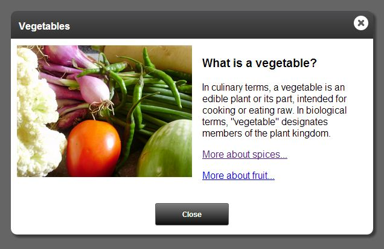
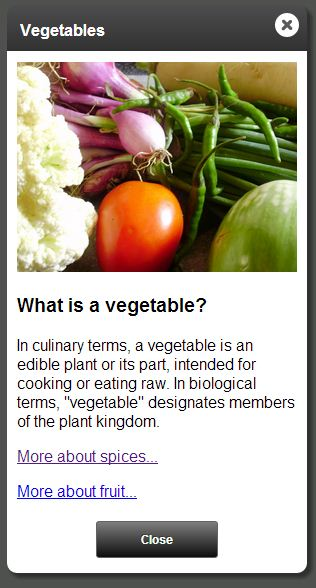

# Modal dialogs

toc

The **jquery.modalDialog** plugin is an extremely powerful and extensible UI widget. It supports responsive design, and is touch friendly.

Example dialog (desktop):

Example dialog (mobile):

## Features

### Content sources
For a dialog's content, the framework can use one of the following techniques:

* Use an element on the page ("node dialog").
* Display a different page within the dialog ("IFrame dialog"). This is really useful for encapsulating the content of a dialog and isolating it from the parent page.
* Load content via AJAX ("ajax dialog"). This is also useful for encapsulating the content of a dialog.

### Cross domain support

* The API for IFrame dialogs works seamlessly across different domains (i.e. www.vistaprint.com vs secure.vistaprint.com) by internally using window.postMessage()

### Simple sizing rules
* A dialog's height is based on the content size. There is no explicit method to specify the height.
* Even iframe dialogs' height is based on automatic content size detection.

### Mobile support (via responsive design)
The dialog framework supports mobile devices via responsive design.

* On desktops and tablets, modal dialogs act just like Windows/Mac modal dialogs (they are draggable/droppable)
* On small mobile devices (i.e. phone/ipod), the dialogs snap to near-full screen, and are not draggable.

### Unobtrusive syntax
Dialogs can be created with a simple markup-based syntax, or, if you need more control, you can use the full rich dialog API.

This unobtrusive syntax makes your dialogs SEO friendly, and will help you design sites that gracefully degrade on older devices.

### Skinning support

Dialogs can be skinned simply via CSS. Multiple skins are supported.

### Event driven extensibility

Dialogs publish [events](#events) that can be used to extend their functionality.

## Demo
[Live demo >>](modal-dialogs-demo.html)

## Usage

### Adding jQuery.modalDialog to your site

Using the (skinny.js Download Builder)[http://vistaprint.github.io/SkinnyJS/download-builder.html], create a custom build which includes jquery.modalDialog, along with any other skinny.js libraries you want. Include the following CSS and JavaScript files:



<!--Modal dialog structure-->
<link rel="stylesheet" href="skinnyjs/css/jquery.modalDialog.css" />

<!--The skins css file is designed to be customized by you-->
<link rel="stylesheet" href="skinnyjs/css/jquery.modalDialog.skins.css" />

<!--Include jquery before skinny.js-->

<!--Custom build of skinny.js from the download builder. Should include all dependencies for modal dialogs-->

<!--skinny.js Modal dialog library-->



### Creating a dialog

Dialogs are designed to be used unobtrusively, but the entire programmatic API is exposed as well.

Here's an example of unobtrusive usage:


<!-- define a link to a dialog -->
<a href="#fruitsAndNuts" data-rel="modalDialog">Fruits and Nuts</a>

<!-- elsewhere in the document, define the content of the dialog... -->

    Fruits and nuts are delicious, and good for you too.



Note the **data-rel="modalDialog"** attribute: this automatically creates an event handler which will open a
dialog using the target of the link's *href* as the dialog content.

To create a dialog programmatically, use one of the following methods:


// Returns a jQuery object. Used for function/jQuery style code/chaining.
$("#fruitsAndNuts").modalDialog();

// Returns a ModalDialog object that can be used in OO style code.
$.modalDialog.create({ content: "#fruitsAndNuts" }).open();


For more information on the OO style, see [Dialog object methods](#dialog_object_methods).

#### Declarative dialog attributes

When using the programmatic syntax to open dialogs, you can use the following attributes to declaratively define settings for the dialog (note that these correspond
exactly to the [Settings](#settings) you can pass to the modalDialog programmatic API):

* **data-dialog-title**: Defines the title that shows in the title bar of the dialog         
* **data-dialog-onopen**: An inline event handler that fires when the dialog is opened. See [Events](#events) for more information.
* **data-dialog-onbeforeopen**: An inline event handler that fires before the dialog is opened. See [Events](#events) for more information.  
* **data-dialog-onclose**: An inline event handler that fires when the dialog is closed. See [Events](#events) for more information.        
* **data-dialog-onbeforeclose**: An inline event handler that fires before the dialog is closed. See [Events](#events) for more information.      
* **data-dialog-maxwidth**: Sets the maximum width of the dialog. Note that on small mobile devices, the actual width may be smaller, so you should design the dialog content accordingly. Defaults to 600.
* **data-dialog-destroyOnClose**: If true, the dialog DOM will be destroyed and all events removed when the dialog closes. Defaults to ''false''.   
* **data-dialog-skin**: The name of the skin to use for the dialog. Defaults to "primary".   
* **data-dialog-enablehistory**: If set to false, [history management](#managing_history_browser_backforward_buttons) will be disabled for this dialog, even if enabled globally. Defaults to ''true''. 
* **data-dialog-zindex**: Can be used to set the z-index for the dialog. Don't use this unless you need to participate in a pre-existing z-index arms race. Defaults to 10000.


<a href="#fruitsAndNuts" data-rel="modalDialog">Fruits and Nuts</a>

    Fruits and nuts are delicious, and good for you too.



#### Settings

`$(selector).modalDialog()` (and `$.modalDialog.create()`) takes a settings object as an argument. Here are the available settings:

* **title**: The title to display in the title bar of the dialog.
* **id**: The internal ID of the dialog. If the same ID is passed to <code>$.modalDialog.create()</code> more than once, the existing dialog is reused.
* **maxWidth**: Sets the maximum width of the dialog. Note that on small mobile devices, the actual width may be smaller, so you should design the dialog content accordingly. Defaults to 600.
* **skin**:  The name of the skin to use for the dialog. Defaults to "primary".
* **ajax**:  Determines how the ''url'' setting is interpreted. If true, the URL is the source for an AJAX dialog. If false, it will be the URL of an IFrame dialog.
* **url**:  The URL for the content of an IFrame or AJAX dialog.
* **content**:  A CSS selector or jQuery object for a content node to use for a node dialog (omitted when using the $.fn.modalDialog() syntax)
* **destroyOnClose**:  If true, the dialog DOM will be destroyed and all events removed when the dialog closes. Defaults to ''false''.
* **containerElement**:  A CSS selector or jQuery object for the element that should be the parent for the dialog DOM (useful for working with jQuery mobile). Defaults to "body".
* **preventEventBubbling**:  If true, click and touch events are prevented from bubbling up to the document. Defaults to ''true''.
* **onbeforeopen**: A handler for the ''beforeopen'' event. See [Events](#events) for more information.
* **onopen**: A handler for the ''open'' event. See [Events](#events) for more information.
* **onclose**: A handler for the ''close'' event. See [Events](#events)] for more information.
* **onbeforeclose**: A handler for the ''beforeclose'' event. See [Events](#events) for more information.
* **onajaxerror**:  A handler for the ''ajaxerror'' event. See [Events](#events) for more information.
* **enableHistory**: If set to false, [history management](#managing_history_browser_backforward_buttons) will be disabled for this dialog, even if enabled globally. Defaults to ''true''. 
* **zIndex**: Can be used to set the z-index for the dialog. Don't use this unless you need to participate in a pre-existing z-index arms race. Defaults to 10000.

Here's an example. Note that you can (and usually should) do this all with *data-dialog* attributes:

$("#fruitsAndNuts").modalDialog({ 
    title: "Fruits and Nuts",
    skin: "secondary",
    onbeforeopen: function(e) { 
        if (!confirm('Are you sure you want to learn about this?') { 
            e.preventDefault(); 
        }
    }
});



    Fruits and nuts are delicious, and good for you too.



### Dialog object methods

`$.modalDialog.create()` returns a dialog object with the following methods:

* **open()**: Opens the dialog. Returns a promise that will be resolved when the open animation is complete.
* **close()**: Closes the dialog. Returns a promise that will be resolved when the close animation is complete.
* **center()**: Centers the dialog based on the current dimensions
* **setTitle()**: Sets the title displayed in the dialog's title bar
* **getWindow()**: Gets a reference to the window for the dialog. For an IFrame dialog, this is the content window, for node or AJAX dialogs, it is the host window. This is useful for sending messages between dialogs.
* **getParent()**: Gets a reference to the dialog object immediately below the current dialog in visual stacking order (usually the one that opened it). This will be null for a dialog that was opened directly from the host window, and has no parent dialog.

For example:


var dialog = $.modalDialog.create({ content: ".color-dialog" });
dialog.open();
 
//close dialog
dialog.close();


You can call any dialog methods using the jQuery idiomatic syntax as well:


// Creates and opens the dialog
$(".color-dialog").modalDialog();

// Closes the dialog
$(".color-dialog").modalDialog("close");

// Centers the dialog
$(".color-dialog").modalDialog("center");

// Sets the title of the dialog
$(".color-dialog").modalDialog("setTitle", "Select a Color");


Or, you can get the modal dialog object from the jQuery idiomatic syntax:


// Creates and opens the dialog
$(".color-dialog").modalDialog();

// Closes the dialog
var dialog = $(".color-dialog").modalDialogInstance();

// Now you have a reference to the dialog
dialog.close();


#### open(), close(), and promises
open() and close() return promises. This allows chaining of actions:


var dialog = $.modalDialog.create({ content: ".color-dialog" });
dialog.open()
    .then(function() {
        // The dialog is completely open

        // Close the dialog (also returns a promise)
        return this.close();
    })
    .then(function() {
        // The dialog is completely closed
    });
 


## Types of dialogs

### Node dialogs

So far, all examples are "node dialogs". These are dialogs that use an element on the page as the dialog's content.

### AJAX dialogs

An AJAX dialog is created using content which is dynamically loaded from a URL. 

Some examples:


<!-- 
    Using unobtrusive style.
    Content is loaded via ajax from /nutrition-information/fruits-and-nuts.html
-->
<a href="/nutrition-information/fruits-and-nuts.html" 
    data-rel="modalDialog" 
    data-dialog-ajax="true">Fruits and Nuts</a>



//Using OO style
var dialog = $.modalDialog.create({ url: "/nutrition-information/fruits-and-nuts.html", ajax: true, title: "Fruits and Nuts" });
dialog.open();
 
//close dialog
dialog.close();


#### AJAX dialog content

AJAX dialogs' content can be specified one of two ways:
* **Full HTML documents**. The body of the document is extracted and added to the dialog. If there is a TITLE tag in the document, and a title wasn't explicitly set in the dialog settings, the TITLE tag text will be used for the dialog title bar.


<!DOCTYPE html>
<html>
<head>
  <meta charset="utf-8">
  <!-- value of the TITLE tag will display in the dialog's title bar -->
  <title>Fruits and nuts</title>
</head>
<body>
    Here's some information about fruits and nuts
</body>
</html>


* **Partial HTML** (i.e. just the HTML that should go in the dialog content).


<!-- 
    This document contains no HTML, head, or body tags.
    It will get loaded via ajax.
-->

Here's some information about fruits and nuts



##### JavaScripts in AJAX dialog content

No modal dialog specific scripts need to be included in the AJAX dialog content.

Any scripts included in the content will get loaded/executed dynamically, after the DOM elements have been loaded. Script tags that refer to scripts which are are already loaded in the window will be ignored (not loaded/executed a second time), but inline script snippets will be executed.

**Note:** This is a feature of the skinny.js [jquery.partialLoad plugin](js/jquery.partialLoad.html), and can be used independently of modal dialogs.

### IFrame dialogs

IFrame dialogs contain an embedded IFrame that shows a self-contained webpage. These are particularly useful for a few reasons:

* They can encapsulate the dialog's content completely.
* HTML, scripts, and CSS are completely isolated from the parent window.
* They can load content cross-domain.
* You can use the exact same API from the content window as in the host window. This is implemented using a proxy which
communicates with the host window via the skinny.js [jquery.postMessage plugin](js/jquery.postMessage.html)

To create an IFrame dialog, use the following syntax:


<!-- 
    Using unobtrusive style.
    Content is loaded via an iframe from /nutrition-information/fruits-and-nuts.html
-->
<a href="/nutrition-information/fruits-and-nuts.html" 
    data-rel="modalDialog" 
    data-dialog-title="Fruits and Nuts">Fruits and Nuts</a>


or, the programmatic version:


    $.modalDialog.create({ url: "/nutrition-information/fruits-and-nuts.html" }).open();


In an IFrame dialog, the height of the dialog is determined by the content.

#### Content of an IFrame dialog

IFrame dialog content windows can be complete HTML documents. They should not include the main layout of your site, because they will be contained within the dialog's "chrome".



<!--Modal dialog content structure-->
<link rel="stylesheet" href="skinnyjs/css/jquery.modalDialogContent.css" />

<!--Include jquery before skinny.js-->

<!--Custom build of skinny.js from the download builder. Should include all dependencies for modal dialogs-->

<!--
skinny.js Modal dialog content library.
IMPORTANT: Do NOT include the jquery.modalDialog.js library in an iframe content window.
Use the jquery.modalDialogContent.js instead.
This contains an API that mimics the API for the host window, but is implemented as 
proxy objects that communicate with the host window via postMessage.
-->



##### Notifying the parent window when the IFrame is rendered and ready to show
The dialog framework waits to show an IFrame dialog until it's content window notifies it that it is fully rendered. By default, this happens on window.onload.

In certain cases, a dialog may require extra initialization (i.e. it may use JavaScript to render some content), and is not necessarily ready on window.onload. To handle this, you would want to disable manual notification to the framework that the dialog is ready by setting the following property (in the content window):


$.modalDialog.manualNotifyReady = true;


Then, when your dialog's content is fully rendered, call:


$.modalDialog.getCurrent().notifyReady();


##### Dialog size
The size of the dialog is determined automatically based on the size of the content in the IFrame. Because it can be tricky to determine the height of content in HTML, there are a few configuration options to help the framework determine the size:

* **$.modalDialog.autoSizing**: If enabled, the dialog framework looks for changes to content size and adjust the dialog size automatically. True by default.
* **$.modalDialog.sizeElement**: A CSS selector for an element that the framework should measure to get the size of the content. By default, it looks for an element matching the selector .dialog-content-size.

If $.modalDialog.autoSizing' is set false, then you will want to resize the dialog manually using one of the following methods:


// Set height explicitly
$.modalDialog.getCurrent().setHeight(400);

// Set height based on content
$.modalDialog.getCurrent().setHeightFromContent();


##### Dialog title
The title displayed in the dialog is driven by the HTML title tag of the document in the IFrame. You can override this by specifically calling:


    $.modalDialog.getCurrent().setTitle("New title");


##### Cross-domain support
If your IFrame content is in a different domain than the parent window, you need to tell the content window how to reach the parent window:


    $.modalDialog.parentHostName = "http://www.vistaprint.com";


##### Calling other dialog APIs from the iframe content window
You can use any of the dialog APIs from the iframe content window. For example:


    // Close the dialog
    $.modalDialog.getCurrent().close();

    // Center the dialog
    $.modalDialog.getCurrent().center();


##### Sending messages between windows
You can use the dialog framework to post messages between windows (uses either HTML5 postMessage() or the [jquery.postMessage plugin](js/jquery.postMessage.html) under the hood).

For example, imagine you'd like to send a message to the host (parent) window from a dialog content window. Here's the code that you would call in the content window:

    // Send a message using the skinny.js jquery.postMessage() plugin
    $.modalDialog.getCurrent().postMessageToParent("hi parent, here's some data from your child");


Then, you can receive the message in the parent window:

    $(window).on("message", function(e) {
        // Cross domain security
        if (e.origin != "http://mydomain.com") {
            return;
        }

        alert("The message is: " + e.data);
    });


Or, conversely, you can send a message to the iframe dialog content window from the parent:


    $.modalDialog.getCurrent().postMessage("hi child, here's some data from your parent");


### Creating multiple active dialogs

Dialogs can be opened in succession (i.e. a dialog can open another dialog). This even works from an IFrame dialog, and even across domains.

To open a dialog from another dialog (including an IFrame dialog), simply use `$.modalDialog.create()`.

**Warning**: There is one important exception: An IFrame dialog cannot open a node dialog. This is because the IFrame is, by definition, in a different window than the host window, and cannot share its DOM with the parent window. You can, however, open an AJAX dialog, or another IFrame dialog from an IFrame dialog.

### Events

Dialogs support a number of lifecycle events:

* **beforeopen**: Fires before the dialog opens. Calling event.preventDefault() on the event object will cancel the opening of the dialog.
* **open**: Fires after the dialog has opened, and has animated into place.
* **beforeclose**: Fires before the dialog closes. Calling event.preventDefault() on the event object will cancel the closing of the dialog. The property event.isDialogCloseButton indicates that the top dialog close button was clicked.
* **close**: Fires after the dialog closes. The property event.isDialogCloseButton indicates that the top dialog close button was clicked.
* **ajaxerror**: Fires if an error occurs loading an AJAX dialog.

#### Handling events
There are two ways to assign event handlers, as options to `$.modalDialog.create()`, or by adding event handlers to the dialog object returned by `$.modalDialog.create()`.

Here is an example of using the beforeopen event:


$.modalDialog.create({ 
    url: "/foo.aspx", 
    onbeforeopen: function(e) { 
        if (!confirm("Are you sure you want to open this dialog?")) {
            e.preventDefault(); 
        }
    });


This example is completely equivalent:


var dialog = $.modalDialog.create({ url: "/foo.aspx" });
dialog.onbeforeopen.add(function(e) { 
    if (!confirm("Are you sure you want to open this dialog?")) { 
        e.preventDefault(); 
    }
});


**Tip**: These events are even supported in cross-domain IFrame dialogs!

#### Unobtrusive dialog events

If you want to assign handlers unobtrusively, you can access the dialog when it is created with the dialogcreate event:


<a href="#colorPicker" data-rel="modalDialog" id="colorPickerLink">Show color picker</a>


Then, in script, you can access the dialog:


$("#colorPickerLink").on("dialogcreate", function(e)
{
    e.dialog.onopen.add(function() { alert("opened"); });
});


### Managing history (browser back/forward buttons)

The dialog API has a built-in history management module. It can be enabled by calling:


$.modalDialog.enableHistory();


When a dialog is opened, the URL is updated with a querystring parameter that encapsulates the state of the dialog. If the user hits the "back" button,
the dialog is closed. The history module handles cases where the user refreshes, clicks forward, etc.

You can override the default parameter name that the history management module uses:


// This will make URLs look like: /url.html?someAlternateParameterName={opaque parameters}
$.modalDialog.enableHistory("someAlternateParameterName");


The history management module is disabled by default to accommodate more advanced applications that wish to manage history themselves (i.e. using a router in Backbone.js).

You can also disable/enable history management per dialog:


var dialog = $.modalDialog.create({ enableHistory: false });


Or declaratively:



    content



### Skinning

To create a skin (theme) for a dialog, you simply create a CSS class. Then you can assign the skin using the **data-dialog-skin** attribute or settings option.

Starter themes are provided in a LESS (css/jquery.modalDialog.skins.less) or corresponding CSS file (css/jquery.modalDialog.skins.css) if you do not use LESS. These files are designed to be customized by you.

* **primary**: A basic theme.
* **neutral**: A variation on the 'primary' theme.
* **lightbox**: A variation that demonstrates the power of responsive design. On desktop/tablet, this displays as a regular dialog, but on a small mobile device, it will display in a lightbox/gallery style.

Lightbox skin (desktop):

Lightbox skin (mobile):

